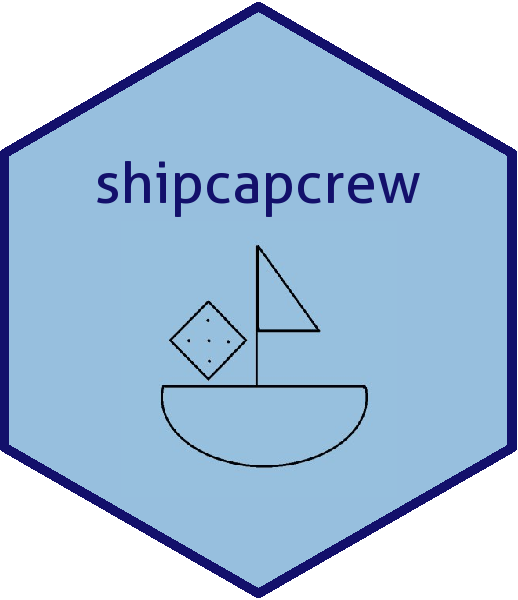

<!-- README.md is generated from README.Rmd. Please edit that file -->

# shipcapcrew </a>

<!-- badges: start -->
[](https://www.tidyverse.org/lifecycle/#experimental)
[](https://travis-ci.org/jormacmoo/shipcapcrew)
<!-- badges: end -->

R package for ‘Ship, Captain, Crew’ Dice Game

`shipcapcrew` allows users to interactively play the game or run
simulated gameplay scenarios with different strategies.

## Install

To install the development version from GitHub, use:

``` r
devtools::install_github("jormacmoo/shipcapcrew")
```

## Description of Game

### How to Play

#### Rules

Ship, Captain, Crew is a game that requires five six-sided dice and
usually at least two players. Each player has at most three rolls they
can use per game, the initial roll and two optional rerolls. Using their
three rolls, each player tries to obtain a ship, a captain, and a crew,
in that specific order. A ship is represented by a 6, a captain is
represented by 5, and a crew is represented by a 4. Once these three
dice are obtained, the sum of the remaining two dice (their cargo) is
the player’s score. If a player is unable to assemble a ship, captain,
and crew, then their score is zero. The player with the highest cargo
score wins the game. [Click here to view a more in-depth description of
the rules for the
game.](https://www.dicegamedepot.com/ship-captain-and-crew-dice-game-rules/)

#### Example

On Charlie’s first roll, they get: 6,4,3,3,2. They are able to keep the
6, however they are not able to keep the 4, since they did not roll a 5.
Charlie now has a ship, four remaining dice, and two more rolls. On
Jordan’s first roll, they get: 5, 4, 3, 3, 2. The are unable to keep any
of their dice, since they did not roll a 6. Jordan has nothing, five
remaining dice, and two more rolls.

On Charlie’s second roll, they get: 5, 3, 2, 1. They are able to keep
the 5, since they already have a 6. Charlie now has a ship, a captain,
three remaining dice, and one more roll. On Jordan’s second roll, they
get: 6, 6, 5, 3, 2. They are able to keep one 6 and the 5. Jordan now
has a ship, a captain, three remaining dice, and one more roll.

On Charlie’s third roll, they get: 6, 5, 2. They are unable to keep any
of these dice, since they were not able to obtain a crew. Charlie now
has a ship, a captain, three remaining dice, and no more rolls. Since
Charlie was unable to assemble a crew, they have a score of 0. On
Jordan’s third roll, they get: 6, 4, 1. They are able to keep the 4,
since they already have a 6 and a 5. This means that their remaining
dice, added together is 7, represents their cargo score.

Since Jordan’s final score is 7 and Charlie’s final score is 0, Jordan
wins the game\!

## Two Main Components of The Package

### Interactive Gameplay

The text-based interactive gameplay begins by calling the function
`start_game()` and responding to any prompts in the console.

Two examples of the interactive gameplay functionality of the package:

When a player wins: Hooray\!


When a player loses, replays, and loses again: Womp womp.


### Gameplay Simulations

The simulation component of `shipcapcrew` is based on three primary
user-facing functions:

  - `start_simulation` initializes a single-player game simulation
  - `multiplayer_simulation` initializes a two-player game simulation
  - `reset_simulation` configures the global environment so additional
    simulations may be run

Together, these functions allow a user to input a desired number of
games to play, plus strategies for gameplay, and run a series of games
in quick succession in order to obtain results. `start_simulation` and
`multiplayer-simulation` each rely on a series of back-end helper
functions in order to execute gameplay; the final output of a call to
either of these functions is a `data.frame` of game outcomes, though
neither of these functions generates the `data.frame` itself.

**When running multiplayer simulations**, be sure to run
`reset_simulation` after each one; this will ensure that your
environment is configured properly to allow for additional multiplayer
simulations to be run\!

Below are examples of how this simulation functionality can be used. The
structure of the output `data.frame` facilitates its use in creating
plot(s) of score distributions.


