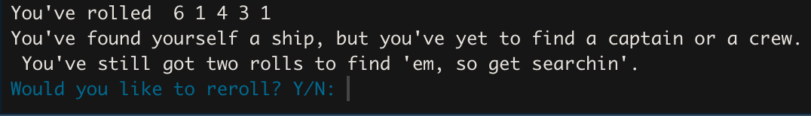
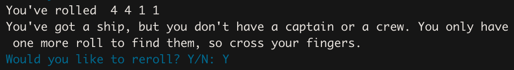
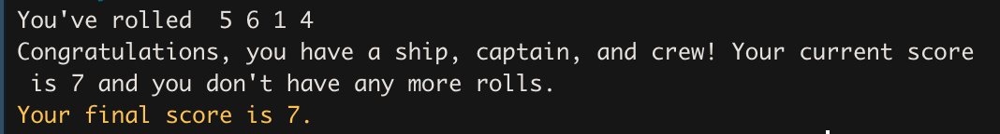
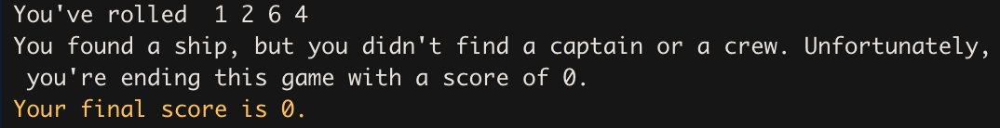
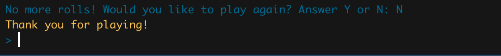

```{r, include = FALSE}
knitr::opts_chunk$set(
  collapse = TRUE,
  comment = "#>"
)
```

```{r setup}
library(shipcapcrew)
```

## There Are Two Main Components of this Package:

### **1.** Interactively Playing 'Ship, Captain, Crew`
### **2.** Simulating Game Play Scenarios for 'Ship, Captain, Crew'

*If you have not done so already, please refer to the ReadME for a description of how to play the game.*

# **Interactively Playing the Game**

This aspect of the package is fairly straight forward. To initiate a single-player game, the only gameplay style for this component, simply use the `start_game()` function. No further arguments are required to start the game, however having your console visable will be helpful. 

```{r, eval = FALSE}
start_game()
```

Once the game is initiated, the console will present the player with their first set of rolled dice. 




Player will be made aware of the dice they rolled, the ones that they are allowed to keep, the ones they need to obtain, and how many rolls they have left in the game. 

Player will then be asked if they would like to reroll and should indicate either:

"Y", for yes they would like to reroll **OR** "N", for no they would not like to reroll

*either way, make sure to capitalize the letter*

If player decides that they would like to reroll, then the number of their remaining dice that was not kept from the previous roll will be rerolled. Player again will shown they newly rolled nice, told what dice will be kept on their behalf, if any, what dice they still need to collect, and how many rolls they have remaining.



Player can continue this process, if they choose, until they have used all three of their rolls. At this point, if the player has collected a 6, 5, and 4 (representing a ship, captain, and crew), then their last two remaining dice will be added up to present their final cargo score.



If they were unable to obtain all three required dice, then their score will be zero. 



At any point in the game, players opt out of playing by answering "N" to *Would you like to reroll?* or *Would you like to play again?* At this point, players will thanked for playing and the function will be halted.



If at any point the player would like to play the game again, they should simply rerun the function!

